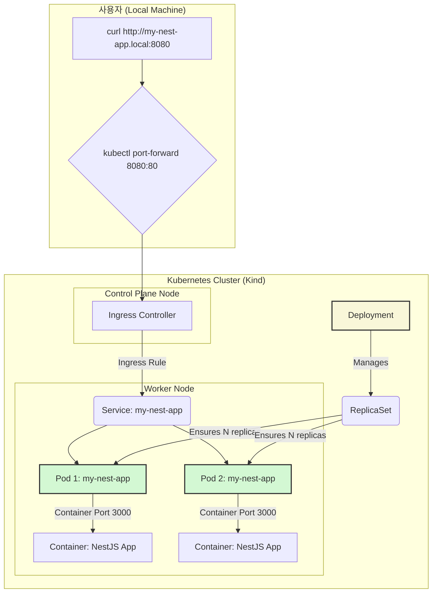

# 개념 정리: 쿠버네티스 핵심 요소 다시보기

지금까지의 실습을 통해 우리는 여러 `kubectl`, `helm` 명령어를 사용하고 YAML 파일을 적용하며 애플리케이션을 성공적으로 배포했습니다. 이제 우리가 무심코 사용했던 그 "레고 블록"들이 각각 무엇이었는지, 그리고 어떻게 상호작용했는지 개념적으로 정리해볼 시간입니다.

### 기본 구성 요소 (Lego Blocks)

#### 1. 파드 (Pod)
*   **무엇이었나?** `k9s`에서 봤던 `my-nest-app-...`이 바로 파드입니다. 쿠버네티스에서 **가장 작은 배포 단위**이며, 우리 NestJS 앱 컨테이너를 담고 있던 "캡슐"이었습니다.
*   **특징:** 파드는 언제든 죽고 새로 태어날 수 있는 일회용품(disposable)입니다. 실제로 6단계에서 파드를 직접 삭제했을 때, 디플로이먼트가 즉시 새로운 파드를 만드는 것을 확인했습니다.

#### 2. 서비스 (Service)
*   **무엇이었나?** `helm`이 만들어준 `my-nest-app` 서비스입니다.
*   **왜 필요했나?** 파드의 IP는 계속 바뀌기 때문에, Ingress Controller가 안정적으로 요청을 전달할 고정된 목적지가 필요했습니다. 서비스는 변화무쌍한 파드들 앞에서 고정된 내부 IP와 DNS 이름을 제공하는 "교통 경찰" 역할을 했습니다.

#### 3. 디플로이먼트 (Deployment)
*   **무엇이었나??** `helm`이 만들어준 `my-nest-app` 디플로이먼트입니다.
*   **역할:** "NestJS 앱 파드를 항상 1개(또는 그 이상) 실행시켜줘"라는 우리의 선언을 현실로 만들어준 "현장 감독관"이었습니다. 6단계에서 파드를 삭제했을 때, 새로운 파드를 즉시 생성하여 선언된 상태를 유지해준 것이 바로 이 디플로이먼트입니다.

### 워크로드 (Workloads) 란?

워크로드는 쿠버네티스에서 애플리케이션을 실행하는 방법을 정의하는 객체입니다. 우리는 가장 일반적인 워크로드인 `Deployment`를 사용했습니다. 친구분의 지식 확장을 위해 다른 종류도 알아봅시다.

*   **Deployment**: 우리 앱처럼 상태가 없는(Stateless) 애플리케이션에 가장 적합합니다. 파드들이 모두 동일하며, 순서나 고유한 이름이 중요하지 않습니다.
*   **StatefulSet**: 상태가 있는(Stateful) 애플리케이션을 위한 워크로드입니다. (예: 데이터베이스) 각 파드는 `app-0`, `app-1`처럼 고유하고 예측 가능한 이름을 가지며, 순서대로 생성되고 삭제됩니다. 각 파드는 자신만의 고유한 저장 공간(Persistent Volume)을 가질 수 있습니다.
*   **DaemonSet**: 클러스터의 모든 (또는 특정) 노드에 파드 복제본이 **하나씩** 실행되도록 보장합니다. (예: 로그 수집기, 모니터링 에이전트) 새 노드가 클러스터에 추가되면, 데몬셋은 자동으로 해당 노드에 파드를 추가합니다.

### 전체 흐름도 (Mermaid)

이제 이 다이어그램이 훨씬 명확하게 보일 것입니다. 사용자의 `curl` 요청부터 우리 앱 컨테이너까지의 전체 여정과, 그 과정에 어떤 컴포넌트들이 관여했는지 다시 한번 복기해 보세요.

---

이것으로 `kind`를 활용한 쿠버네티스 입문 가이드를 마칩니다. 이 프로젝트의 구조와 개념을 바탕으로 더 다양한 실험을 해보시길 바랍니다!

**[⬆️ 처음으로 돌아가기](../README.md)**

### 전체 흐름도 (Mermaid)

이제 이 다이어그램이 훨씬 명확하게 보일 것입니다. 사용자의 `curl` 요청부터 우리 앱 컨테이너까지의 전체 여정과, 그 과정에 어떤 컴포넌트들이 관여했는지 다시 한번 복기해 보세요.

---

이것으로 `kind`를 활용한 쿠버네티스 입문 가이드를 마칩니다. 이 프로젝트의 구조와 개념을 바탕으로 더 다양한 실험을 해보시길 바랍니다!

**[⬆️ 처음으로 돌아가기](../README.md)**
