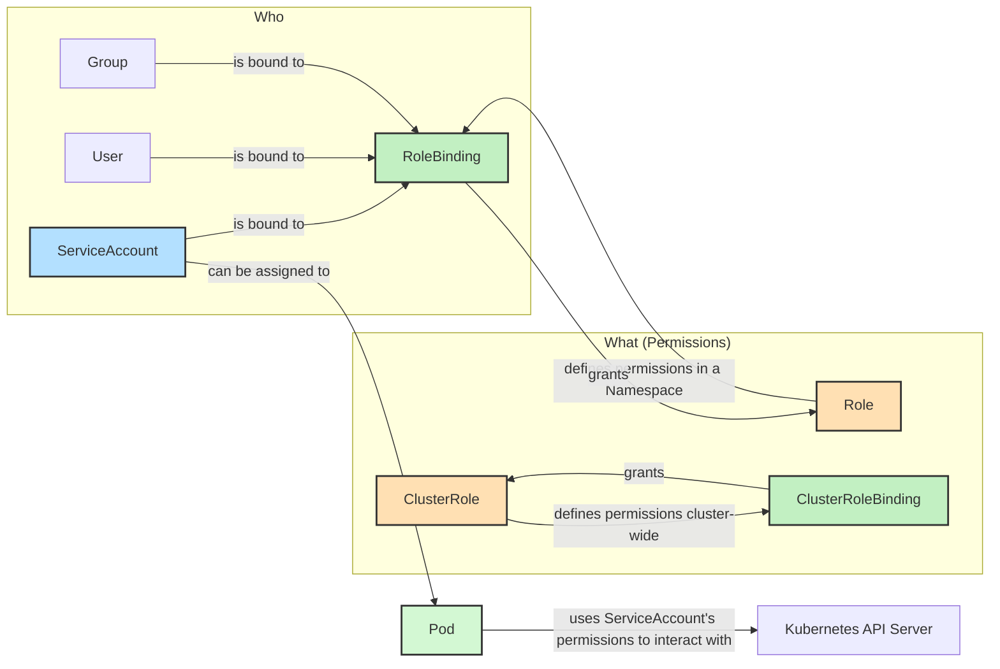

# 9단계 (심화): RBAC (Role-Based Access Control) 심화 학습

쿠버네티스에서 **RBAC (Role-Based Access Control)**는 누가(Who) 어떤 리소스에 대해 어떤 작업(What)을 할 수 있는지 정의하는 보안 메커니즘입니다. 이는 클러스터의 보안을 유지하고, 사용자 및 애플리케이션에 필요한 최소한의 권한만 부여하는 데 필수적입니다.

### RBAC의 핵심 구성 요소

1.  **ServiceAccount:**
    *   **무엇인가?** 사람(User)이 아닌, **쿠버네티스 클러스터 내에서 실행되는 프로세스(파드)의 신원**입니다.
    *   **왜 필요한가?** 파드가 쿠버네티스 API 서버와 통신하여 클러스터 내의 다른 리소스(예: 파드 목록 조회, 디플로이먼트 생성)에 접근해야 할 때, 이 ServiceAccount의 권한을 사용합니다. 모든 파드는 기본적으로 `default` ServiceAccount를 가집니다.

2.  **Role / ClusterRole:**
    *   **무엇인가?** **수행할 수 있는 작업(권한)의 집합**을 정의합니다.
    *   **Role:** 특정 **네임스페이스 내에서만 유효**한 권한을 정의합니다. (예: `default` 네임스페이스에서 파드를 조회할 수 있는 권한)
    *   **ClusterRole:** 클러스터 전체에 걸쳐 유효한 권한을 정의합니다. (예: 모든 네임스페이스에서 노드를 조회할 수 있는 권한)
    *   **예시:** `pods` 리소스에 대해 `get`, `list`, `watch` 작업을 허용하는 Role을 정의할 수 있습니다.

3.  **RoleBinding / ClusterRoleBinding:**
    *   **무엇인가?** **누구에게(ServiceAccount, User, Group) 어떤 권한(Role/ClusterRole)을 부여할지 연결**하는 역할을 합니다.
    *   **RoleBinding:** 특정 **네임스페이스 내에서만 유효**한 Role을 ServiceAccount에 연결합니다.
    *   **ClusterRoleBinding:** ClusterRole을 ServiceAccount에 연결하여 클러스터 전체 권한을 부여합니다.

### RBAC 흐름도 (Mermaid)



### 실습: 특정 리소스 조회 권한 부여

우리는 `my-nest-app` 파드가 특정 ServiceAccount를 사용하고, 이 ServiceAccount가 `ConfigMap` 리소스를 조회할 수 있는 권한을 가지도록 설정할 것입니다. 이를 통해 애플리케이션이 쿠버네티스 API를 통해 설정 값을 동적으로 가져오는 시나리오를 시뮬레이션할 수 있습니다.

1.  **ServiceAccount 생성:**
    `helm/my-nest-app/templates/serviceaccount.yaml` 파일을 통해 `my-nest-app-sa` ServiceAccount를 생성합니다.

2.  **Role 생성:**
    `helm/my-nest-app/templates/role.yaml` 파일을 통해 `configmap-reader` Role을 생성합니다. 이 Role은 `ConfigMap` 리소스에 대한 `get`, `list`, `watch` 권한을 가집니다.

3.  **RoleBinding 생성:**
    `helm/my-nest-app/templates/rolebinding.yaml` 파일을 통해 `configmap-reader-binding` RoleBinding을 생성합니다. 이 RoleBinding은 `my-nest-app-sa` ServiceAccount에게 `configmap-reader` Role의 권한을 부여합니다.

4.  **Deployment에 ServiceAccount 연결:**
    `helm/my-nest-app/templates/deployment.yaml` 파일에서 `spec.template.spec.serviceAccountName` 필드를 `my-nest-app-sa`로 설정하여, 우리 앱 파드가 이 ServiceAccount를 사용하도록 합니다.

### 실습: RBAC 테스트

1.  **Helm 업그레이드:**

    새로운 RBAC 리소스들을 배포하고, Deployment에 변경사항을 적용하기 위해 Helm 릴리스를 업그레이드합니다.

    ```bash
    helm upgrade my-nest-app ./helm/my-nest-app
    ```

2.  **`k9s`로 리소스 확인:**

    `k9s`를 실행하고 다음 리소스들이 생성되었는지 확인합니다.
    *   `:sa` (ServiceAccount): `my-nest-app-sa`가 생성되었는지 확인합니다.
    *   `:role` (Role): `configmap-reader`가 생성되었는지 확인합니다.
    *   `:rb` (RoleBinding): `configmap-reader-binding`이 생성되었는지 확인합니다.

3.  **파드에서 `kubectl` 실행 (시뮬레이션):**

    실제 앱에서는 쿠버네티스 클라이언트 라이브러리를 사용하지만, 여기서는 파드 내부에서 `kubectl` 명령을 실행하여 RBAC가 적용되었는지 확인해 볼 수 있습니다.

    먼저 앱 파드의 이름을 확인합니다.
    ```bash
    kubectl get pods -l app=my-nest-app -o name
    # 예시 출력: pod/my-nest-app-xxxxxxxxxx-yyyyy
    ```

    이제 파드 내부에서 `kubectl get configmaps` 명령을 실행합니다.
    ```bash
    kubectl exec -it pod/<YOUR_APP_POD_NAME> -- kubectl get configmaps
    ```
    이 명령이 성공적으로 `ConfigMap` 목록을 반환한다면, `my-nest-app-sa` ServiceAccount가 `ConfigMap`을 조회할 권한을 성공적으로 부여받았다는 의미입니다.

    만약 `configmap-reader` Role을 부여하지 않았다면, 이 명령은 `Error from server (Forbidden): configmaps is forbidden...`과 같은 에러를 반환할 것입니다.

---

이것으로 쿠버네티스에서 접근 권한을 관리하는 RBAC의 기본 개념과 사용법을 익혔습니다. 이는 클러스터 보안의 핵심 요소입니다.

**[⬆️ 처음으로 돌아가기](../README.md)**
